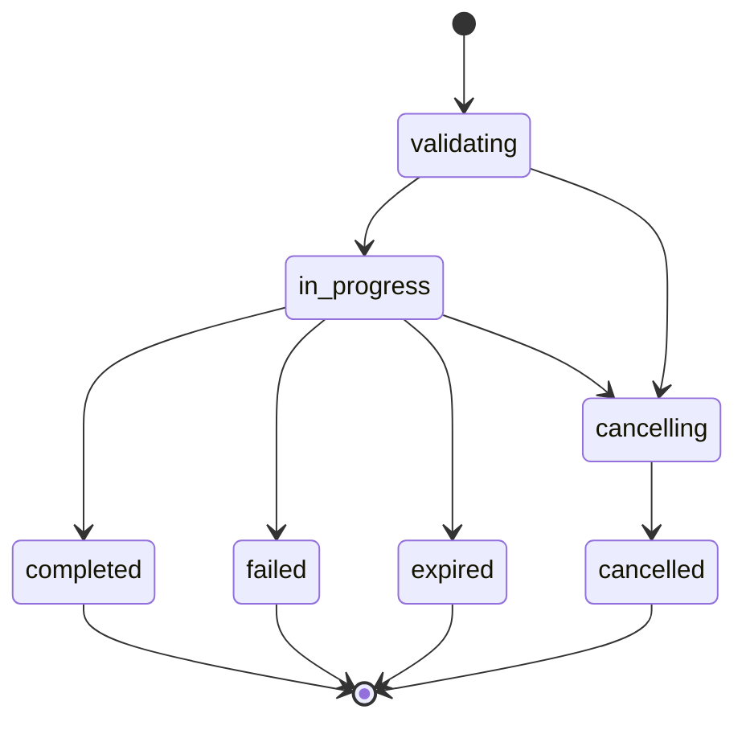

The Batches API lets you submit large collections of API requests as a single job that runs asynchronously. Batch processing is ideal for workloads that do not require real-time responses — such as bulk classification, data extraction, embeddings generation, or offline evaluations — and comes at a 50% discount compared to synchronous API calls.

<Info>
  Batch jobs are processed within a 24-hour window. Most jobs complete well within this timeframe, but plan accordingly for time-sensitive workloads.
</Info>

---

## Authentication

All batch endpoints require a project API key.

```bash
Authorization: Bearer sk-proj-...
```

---

## How it works

<Steps>
  <Step title="Prepare your input file">
    Create a JSONL file where each line is a request object containing a `custom_id`, `method`, `url`, and `body`. Upload it via the [Files API](/api-reference/files) with `purpose: batch`.

    ```jsonl
    {"custom_id": "req-001", "method": "POST", "url": "/v1/chat/completions", "body": {"model": "gpt-4o-mini", "messages": [{"role": "user", "content": "Classify this review as positive or negative: Great product!"}]}}
    {"custom_id": "req-002", "method": "POST", "url": "/v1/chat/completions", "body": {"model": "gpt-4o-mini", "messages": [{"role": "user", "content": "Classify this review as positive or negative: Terrible experience."}]}}
    {"custom_id": "req-003", "method": "POST", "url": "/v1/embeddings", "body": {"model": "text-embedding-3-small", "input": "Vector databases enable semantic search"}}
    ```
  </Step>

  <Step title="Create the batch">
    Submit the batch job by referencing your uploaded file and the target endpoint.

    ```bash
    curl -X POST https://api.continuumai.technology/v1/batches \
      -H "Authorization: Bearer sk-proj-..." \
      -H "Content-Type: application/json" \
      -d '{
        "input_file_id": "file_batch001",
        "endpoint": "/v1/chat/completions",
        "metadata": {
          "project": "sentiment-analysis",
          "run": "weekly-batch-12"
        }
      }'
    ```
  </Step>

  <Step title="Monitor progress">
    Poll the batch status until it reaches a terminal state.

    ```bash
    curl https://api.continuumai.technology/v1/batches/batch_abc123 \
      -H "Authorization: Bearer sk-proj-..."
    ```
  </Step>

  <Step title="Download results">
    Once completed, download the output file using the `output_file_id` from the batch response. Each line contains the original `custom_id` and the corresponding API response.

    ```bash
    curl https://api.continuumai.technology/v1/files/file_output001/content \
      -H "Authorization: Bearer sk-proj-..." \
      --output results.jsonl
    ```
  </Step>
</Steps>

---

## Endpoints

### Create a batch

<ParamField body="input_file_id" type="string" required>
  The ID of the uploaded JSONL input file. Must have `purpose: batch` and `status: processed`.
</ParamField>

<ParamField body="endpoint" type="string" required>
  The API endpoint each request in the batch targets. Supported values: `/v1/chat/completions`, `/v1/embeddings`.
</ParamField>

<ParamField body="metadata" type="object" optional>
  Key-value pairs for tagging and organizing batch jobs. Up to 16 keys.
</ParamField>

<ParamField body="completion_window" type="string" default="24h" optional>
  The time window within which the batch should complete. Currently only `"24h"` is supported.
</ParamField>

<CodeGroup>

```bash cURL
curl -X POST https://api.continuumai.technology/v1/batches \
  -H "Authorization: Bearer sk-proj-..." \
  -H "Content-Type: application/json" \
  -d '{
    "input_file_id": "file_batch001",
    "endpoint": "/v1/chat/completions",
    "metadata": {
      "project": "sentiment-analysis"
    }
  }'
```

```python Python
import requests

response = requests.post(
    "https://api.continuumai.technology/v1/batches",
    headers={"Authorization": "Bearer sk-proj-..."},
    json={
        "input_file_id": "file_batch001",
        "endpoint": "/v1/chat/completions",
        "metadata": {"project": "sentiment-analysis"}
    }
)

batch = response.json()
print(batch["data"]["id"])
```

</CodeGroup>

<Expandable title="Response — 201 Created">
  ```json
  {
    "data": {
      "id": "batch_abc123",
      "object": "batch",
      "endpoint": "/v1/chat/completions",
      "input_file_id": "file_batch001",
      "output_file_id": null,
      "error_file_id": null,
      "status": "validating",
      "request_counts": {
        "total": 0,
        "completed": 0,
        "failed": 0
      },
      "metadata": {
        "project": "sentiment-analysis"
      },
      "completion_window": "24h",
      "created_at": "2026-03-22T18:00:00Z",
      "started_at": null,
      "completed_at": null,
      "expired_at": null,
      "cancelled_at": null
    },
    "status": 201
  }
  ```
</Expandable>

---

### List batches

Returns a paginated list of batch jobs for the current project.

<ParamField query="page" type="integer" default="1" optional>
  Page number for pagination.
</ParamField>

<ParamField query="pageSize" type="integer" default="20" optional>
  Number of batches per page. Maximum: 100.
</ParamField>

<CodeGroup>

```bash cURL
curl "https://api.continuumai.technology/v1/batches?page=1&pageSize=10" \
  -H "Authorization: Bearer sk-proj-..."
```

```python Python
response = requests.get(
    "https://api.continuumai.technology/v1/batches",
    headers={"Authorization": "Bearer sk-proj-..."},
    params={"page": 1, "pageSize": 10}
)
```

</CodeGroup>

<Expandable title="Response — 200 OK">
  ```json
  {
    "data": [
      {
        "id": "batch_abc123",
        "object": "batch",
        "endpoint": "/v1/chat/completions",
        "status": "completed",
        "request_counts": {
          "total": 1000,
          "completed": 998,
          "failed": 2
        },
        "created_at": "2026-03-22T18:00:00Z",
        "completed_at": "2026-03-22T19:45:00Z"
      }
    ],
    "pagination": {
      "page": 1,
      "pageSize": 10,
      "total": 5,
      "totalPages": 1
    }
  }
  ```
</Expandable>

---

### Get a batch

Retrieves the current state of a batch job, including progress counts and output file references.

<ParamField path="batch_id" type="string" required>
  The unique identifier of the batch.
</ParamField>

<CodeGroup>

```bash cURL
curl https://api.continuumai.technology/v1/batches/batch_abc123 \
  -H "Authorization: Bearer sk-proj-..."
```

```python Python
response = requests.get(
    "https://api.continuumai.technology/v1/batches/batch_abc123",
    headers={"Authorization": "Bearer sk-proj-..."}
)
```

</CodeGroup>

<Expandable title="Response — 200 OK">
  ```json
  {
    "data": {
      "id": "batch_abc123",
      "object": "batch",
      "endpoint": "/v1/chat/completions",
      "input_file_id": "file_batch001",
      "output_file_id": "file_output001",
      "error_file_id": "file_errors001",
      "status": "completed",
      "request_counts": {
        "total": 1000,
        "completed": 998,
        "failed": 2
      },
      "metadata": {
        "project": "sentiment-analysis"
      },
      "completion_window": "24h",
      "created_at": "2026-03-22T18:00:00Z",
      "started_at": "2026-03-22T18:01:00Z",
      "completed_at": "2026-03-22T19:45:00Z",
      "expired_at": null,
      "cancelled_at": null
    },
    "status": 200
  }
  ```
</Expandable>

---

### Cancel a batch

Cancels an in-progress batch job. Requests that have already completed will still be available in the output file. Requests that have not yet started will not be processed.

<ParamField path="batch_id" type="string" required>
  The unique identifier of the batch to cancel.
</ParamField>

<CodeGroup>

```bash cURL
curl -X POST https://api.continuumai.technology/v1/batches/batch_abc123/cancel \
  -H "Authorization: Bearer sk-proj-..."
```

```python Python
response = requests.post(
    "https://api.continuumai.technology/v1/batches/batch_abc123/cancel",
    headers={"Authorization": "Bearer sk-proj-..."}
)
```

</CodeGroup>

<Expandable title="Response — 200 OK">
  ```json
  {
    "data": {
      "id": "batch_abc123",
      "object": "batch",
      "status": "cancelling",
      "request_counts": {
        "total": 1000,
        "completed": 450,
        "failed": 0
      },
      "created_at": "2026-03-22T18:00:00Z",
      "cancelled_at": "2026-03-22T18:30:00Z"
    },
    "status": 200
  }
  ```
</Expandable>

<Note>
  Cancellation is not instantaneous. The batch transitions to `cancelling` first, then to `cancelled` once all in-flight requests finish. During this window, some additional requests may complete.
</Note>

---

## Batch status lifecycle



| Status | Description |
|--------|-------------|
| `validating` | Input file is being validated for format and content |
| `in_progress` | Requests are being processed |
| `completed` | All requests finished. Download results from `output_file_id` |
| `failed` | The batch encountered a fatal error. Check `error_file_id` for details |
| `expired` | The batch did not complete within the `completion_window` |
| `cancelling` | Cancellation requested; in-flight requests are finishing |
| `cancelled` | Batch cancelled. Partial results available in `output_file_id` |

---

## Output file format

Each line in the output JSONL file contains the result for one request:

```jsonl
{"custom_id": "req-001", "response": {"status_code": 200, "body": {"id": "chatcmpl-abc", "choices": [{"message": {"role": "assistant", "content": "Positive"}}], "usage": {"prompt_tokens": 25, "completion_tokens": 1, "total_tokens": 26}}}}
{"custom_id": "req-002", "response": {"status_code": 200, "body": {"id": "chatcmpl-def", "choices": [{"message": {"role": "assistant", "content": "Negative"}}], "usage": {"prompt_tokens": 25, "completion_tokens": 1, "total_tokens": 26}}}}
```

If any requests failed, the error file (`error_file_id`) contains the details:

```jsonl
{"custom_id": "req-003", "error": {"code": "INVALID_REQUEST", "message": "model 'nonexistent-model' not found"}}
```

---

## Error codes

| Status | Code | Description |
|--------|------|-------------|
| 400 | `INVALID_INPUT_FILE` | The input file has formatting errors or is not valid JSONL |
| 400 | `UNSUPPORTED_ENDPOINT` | The specified endpoint is not supported for batch processing |
| 401 | `UNAUTHORIZED` | Invalid or missing API key |
| 404 | `BATCH_NOT_FOUND` | The specified batch does not exist |
| 409 | `BATCH_NOT_CANCELLABLE` | The batch is in a terminal state and cannot be cancelled |
| 429 | `RATE_LIMITED` | Too many requests |
