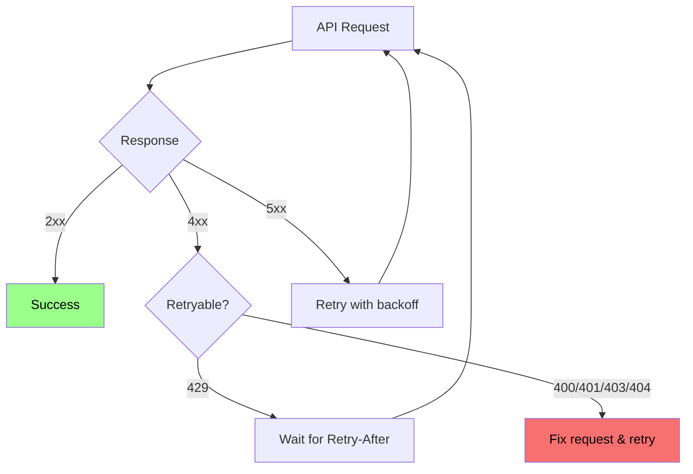

# Errors

When a request fails, the Continuum AI API returns a structured error response with an HTTP status code, a human-readable message, and a machine-readable error code. Use these to build reliable error handling in your applications.

## Error response format

Every error response follows this structure:

```json
{
  "error": {
    "message": "A human-readable description of what went wrong.",
    "code": "ERROR_CODE"
  },
  "status": 400
}
```

<ResponseField name="error.message" type="string" required>
  A description of the error. Safe to display to end users.
</ResponseField>

<ResponseField name="error.code" type="string" required>
  A machine-readable error code. Use this for programmatic error handling rather than parsing the message string.
</ResponseField>

<ResponseField name="status" type="integer" required>
  The HTTP status code, mirrored in the response body for convenience.
</ResponseField>

---

## HTTP status codes

| Status | Meaning | When it occurs |
|-------:|---------|---------------|
| **400** | Bad Request | The request body is malformed, missing required fields, or contains invalid values. |
| **401** | Unauthorized | The API key is missing, invalid, or expired. |
| **403** | Forbidden | The API key is valid but lacks permission for the requested resource or model. |
| **404** | Not Found | The requested resource (model, thread, file) does not exist. |
| **429** | Too Many Requests | You have exceeded your rate limit. Back off and retry. |
| **500** | Internal Server Error | An unexpected error occurred on our side. Retry with exponential backoff. |
| **502** | Bad Gateway | An internal service error occurred. Retry or try a different model. |

---

## Error codes

<AccordionGroup>
  <Accordion title="INVALID_REQUEST_BODY" icon="circle-xmark">
    **HTTP status:** 400

    The request body could not be parsed as valid JSON or contains fields with invalid types or values.

    ```json
    {
      "error": {
        "message": "Request body is not valid JSON. Check for trailing commas or unquoted keys.",
        "code": "INVALID_REQUEST_BODY"
      },
      "status": 400
    }
    ```

    **How to fix:**
    - Validate your JSON before sending (use a linter or `JSON.parse()` test)
    - Check that numeric fields are numbers, not strings
    - Ensure `messages` is an array, not an object
  </Accordion>

  <Accordion title="MISSING_MODEL" icon="circle-xmark">
    **HTTP status:** 400

    The `model` field is required but was not included in the request body.

    ```json
    {
      "error": {
        "message": "The 'model' field is required. Specify which model to use (e.g., 'continuum-ultra').",
        "code": "MISSING_MODEL"
      },
      "status": 400
    }
    ```

    **How to fix:** Add a `"model"` field to your request body.
  </Accordion>

  <Accordion title="UNSUPPORTED_MODEL" icon="circle-xmark">
    **HTTP status:** 400

    The specified model does not exist in the Continuum AI model catalog.

    ```json
    {
      "error": {
        "message": "Model 'gpt-5-turbo' is not a supported model. See /v1/models for available models.",
        "code": "UNSUPPORTED_MODEL"
      },
      "status": 400
    }
    ```

    **How to fix:** Check the model name for typos. Call `GET /v1/models` to see available models.
  </Accordion>

  <Accordion title="MODEL_NOT_ALLOWED" icon="circle-xmark">
    **HTTP status:** 403

    Your API key or plan does not grant access to the requested model.

    ```json
    {
      "error": {
        "message": "Your current plan does not include access to 'continuum-ultra'. Upgrade your plan or use a different model.",
        "code": "MODEL_NOT_ALLOWED"
      },
      "status": 403
    }
    ```

    **How to fix:** Upgrade your plan in the dashboard, or use a model available on your current tier.
  </Accordion>

  <Accordion title="MISSING_MESSAGES" icon="circle-xmark">
    **HTTP status:** 400

    The `messages` array is required for chat completions but was not provided.

    ```json
    {
      "error": {
        "message": "The 'messages' field is required and must be a non-empty array.",
        "code": "MISSING_MESSAGES"
      },
      "status": 400
    }
    ```

    **How to fix:** Include at least one message in the `messages` array with `role` and `content` fields.
  </Accordion>

  <Accordion title="MISSING_INPUT" icon="circle-xmark">
    **HTTP status:** 400

    The `input` field is required for embedding requests but was not provided.

    ```json
    {
      "error": {
        "message": "The 'input' field is required. Provide a string or array of strings to embed.",
        "code": "MISSING_INPUT"
      },
      "status": 400
    }
    ```

    **How to fix:** Add an `"input"` field with the text you want to embed.
  </Accordion>

  <Accordion title="MISSING_PROMPT" icon="circle-xmark">
    **HTTP status:** 400

    The `prompt` field is required for image generation but was not provided.

    ```json
    {
      "error": {
        "message": "The 'prompt' field is required. Describe the image you want to generate.",
        "code": "MISSING_PROMPT"
      },
      "status": 400
    }
    ```

    **How to fix:** Add a `"prompt"` field with your image description.
  </Accordion>

  <Accordion title="UPSTREAM_ERROR" icon="circle-xmark">
    **HTTP status:** 502

    An internal service error occurred or the request timed out.

    ```json
    {
      "error": {
        "message": "An internal service error occurred. Please retry your request.",
        "code": "UPSTREAM_ERROR"
      },
      "status": 502
    }
    ```

    **How to fix:** Retry with exponential backoff. If the issue persists, try a different model or check the [status page](https://status.continuum-ai.com).
  </Accordion>

  <Accordion title="STREAMING_NOT_SUPPORTED" icon="circle-xmark">
    **HTTP status:** 400

    The requested model or endpoint does not support streaming responses.

    ```json
    {
      "error": {
        "message": "Streaming is not supported for this model or endpoint. Set 'stream' to false.",
        "code": "STREAMING_NOT_SUPPORTED"
      },
      "status": 400
    }
    ```

    **How to fix:** Remove `"stream": true` from your request, or use a model that supports streaming.
  </Accordion>

  <Accordion title="THREAD_NOT_FOUND" icon="circle-xmark">
    **HTTP status:** 404

    The specified thread ID does not exist or has been deleted.

    ```json
    {
      "error": {
        "message": "Thread 'thread_abc123' not found.",
        "code": "THREAD_NOT_FOUND"
      },
      "status": 404
    }
    ```

    **How to fix:** Verify the thread ID. Threads are deleted automatically after 30 days of inactivity.
  </Accordion>

  <Accordion title="FILE_TOO_LARGE" icon="circle-xmark">
    **HTTP status:** 400

    The uploaded file exceeds the maximum allowed size.

    ```json
    {
      "error": {
        "message": "File size exceeds the maximum of 512 MB. Reduce the file size and try again.",
        "code": "FILE_TOO_LARGE"
      },
      "status": 400
    }
    ```

    **How to fix:** Compress or split the file. Maximum file size is 512 MB for most endpoints and 25 MB for audio transcription.
  </Accordion>

  <Accordion title="RATE_LIMIT_EXCEEDED" icon="circle-xmark">
    **HTTP status:** 429

    You have sent too many requests in a given time window.

    ```json
    {
      "error": {
        "message": "Rate limit exceeded. Please retry after 2 seconds.",
        "code": "RATE_LIMIT_EXCEEDED"
      },
      "status": 429
    }
    ```

    **How to fix:** Implement exponential backoff. Check the `Retry-After` header for the recommended wait time. Consider upgrading your plan for higher limits.
  </Accordion>

  <Accordion title="UNAUTHORIZED" icon="circle-xmark">
    **HTTP status:** 401

    The request is not authenticated. The API key is missing, malformed, or revoked.

    ```json
    {
      "error": {
        "message": "Invalid API key provided.",
        "code": "UNAUTHORIZED"
      },
      "status": 401
    }
    ```

    **How to fix:** Check that your `Authorization: Bearer <key>` or `X-API-Key` header is present and the key is correct. If the key was recently rotated, update your application with the new key.
  </Accordion>

  <Accordion title="FORBIDDEN" icon="circle-xmark">
    **HTTP status:** 403

    The API key is valid but does not have permission for this action.

    ```json
    {
      "error": {
        "message": "This API key does not have access to the requested resource.",
        "code": "FORBIDDEN"
      },
      "status": 403
    }
    ```

    **How to fix:** Verify the project and organization associated with the key. Check that the project is active and your plan includes the requested capability.
  </Accordion>

  <Accordion title="INTERNAL_ERROR" icon="circle-xmark">
    **HTTP status:** 500

    An unexpected error occurred on the Continuum AI servers.

    ```json
    {
      "error": {
        "message": "An internal error occurred. Please retry your request.",
        "code": "INTERNAL_ERROR"
      },
      "status": 500
    }
    ```

    **How to fix:** Retry with exponential backoff. If the error persists for more than a few minutes, contact support or check the [status page](https://status.continuum-ai.com).
  </Accordion>
</AccordionGroup>

---

## Retry strategy



Not all errors should be retried. Use this guide to determine the correct behavior:

| Status | Retry? | Strategy |
|-------:|--------|----------|
| **400** | No | Fix the request. These are client errors that will not resolve on retry. |
| **401** | No | Fix your authentication. Check your API key. |
| **403** | No | Check permissions. Upgrade your plan or use an allowed model. |
| **404** | No | The resource does not exist. Verify the ID or path. |
| **429** | Yes | Wait for the duration in the `Retry-After` header, then retry. |
| **500** | Yes | Retry with exponential backoff (see below). |
| **502** | Yes | Retry with exponential backoff. Consider trying a different model. |

### Exponential backoff

For retryable errors, use exponential backoff with jitter to avoid thundering herd effects:

```
wait_time = min(base_delay * 2^attempt + random_jitter, max_delay)
```

| Attempt | Base delay | Wait time (approx.) |
|--------:|-----------:|--------------------:|
| 1       | 1s         | 1 -- 1.5s           |
| 2       | 1s         | 2 -- 3s             |
| 3       | 1s         | 4 -- 6s             |
| 4       | 1s         | 8 -- 12s            |
| 5       | 1s         | 16 -- 24s           |

<Warning>
  Set a maximum number of retries (we recommend 5) and a maximum delay (we recommend 60 seconds). Do not retry indefinitely.
</Warning>

---

## Error handling examples

<Tabs>
  <Tab title="Python">
    ```python
    import time
    import random
    import requests

    API_KEY = "sk-proj-your-api-key"
    BASE_URL = "https://api.continuumai.technology/v1"

    def chat_with_retry(messages, model="continuum-ultra", max_retries=5):
        for attempt in range(max_retries):
            response = requests.post(
                f"{BASE_URL}/chat/completions",
                headers={
                    "Authorization": f"Bearer {API_KEY}",
                    "Content-Type": "application/json",
                },
                json={"model": model, "messages": messages},
            )

            if response.status_code == 200:
                return response.json()

            if response.status_code == 429:
                # Rate limited: wait and retry
                retry_after = float(response.headers.get("Retry-After", 2 ** attempt))
                print(f"Rate limited. Retrying in {retry_after}s...")
                time.sleep(retry_after)

            elif response.status_code in (500, 502):
                # Server error: retry with backoff
                wait = min(2 ** attempt + random.random(), 60)
                print(f"Server error ({response.status_code}). Retrying in {wait:.1f}s...")
                time.sleep(wait)

            else:
                # Client error (400, 401, 403, 404): do not retry
                error = response.json()
                print(f"Client error: {error['error']['message']}")
                response.raise_for_status()

        raise Exception(f"Failed after {max_retries} retries")


    # Usage
    result = chat_with_retry(
        messages=[{"role": "user", "content": "Hello!"}]
    )
    print(result["choices"][0]["message"]["content"])
    ```
  </Tab>

  <Tab title="Node.js">
    ```javascript
    const API_KEY = process.env.CONTINUUM_API_KEY;
    const BASE_URL = "https://api.continuumai.technology/v1";

    async function chatWithRetry(messages, model = "continuum-ultra", maxRetries = 5) {
      for (let attempt = 0; attempt < maxRetries; attempt++) {
        const response = await fetch(`${BASE_URL}/chat/completions`, {
          method: "POST",
          headers: {
            "Authorization": `Bearer ${API_KEY}`,
            "Content-Type": "application/json",
          },
          body: JSON.stringify({ model, messages }),
        });

        if (response.ok) {
          return await response.json();
        }

        if (response.status === 429) {
          // Rate limited: wait and retry
          const retryAfter = parseFloat(
            response.headers.get("retry-after") ?? Math.pow(2, attempt)
          );
          console.log(`Rate limited. Retrying in ${retryAfter}s...`);
          await sleep(retryAfter * 1000);

        } else if ([500, 502].includes(response.status)) {
          // Server error: retry with backoff
          const wait = Math.min(Math.pow(2, attempt) + Math.random(), 60);
          console.log(`Server error (${response.status}). Retrying in ${wait.toFixed(1)}s...`);
          await sleep(wait * 1000);

        } else {
          // Client error (400, 401, 403, 404): do not retry
          const error = await response.json();
          console.error(`Client error: ${error.error.message}`);
          throw new Error(error.error.message);
        }
      }

      throw new Error(`Failed after ${maxRetries} retries`);
    }

    function sleep(ms) {
      return new Promise((resolve) => setTimeout(resolve, ms));
    }

    // Usage
    const result = await chatWithRetry([
      { role: "user", content: "Hello!" },
    ]);
    console.log(result.choices[0].message.content);
    ```
  </Tab>
</Tabs>

---

## Debugging tips

<AccordionGroup>
  <Accordion title="Log the full error response" icon="bug">
    Always log the complete error object, including `status`, `code`, and `message`. The `code` field is stable and safe to match against in your code. The `message` field may change between API versions.
  </Accordion>
  <Accordion title="Check the X-Request-ID header" icon="fingerprint">
    Every API response includes an `X-Request-ID` header. Include this ID when contacting support so we can trace your request through our systems.

    ```
    X-Request-ID: req_abc123def456
    ```
  </Accordion>
  <Accordion title="Validate requests locally" icon="check">
    Before sending a request, validate:
    - The JSON is well-formed
    - Required fields (`model`, `messages`, `input`) are present
    - The `messages` array is non-empty and each message has `role` and `content`
    - Token counts are within the model's context window
  </Accordion>
  <Accordion title="Test with curl first" icon="terminal">
    If you are having trouble with a client library, test the same request with `curl` to isolate whether the issue is in your code or the API. Copy the request from the client library's debug log.
  </Accordion>
</AccordionGroup>

## Next steps

<CardGroup cols={2}>
  <Card title="Authentication" icon="shield-halved" href="/api-reference/authentication">
    Make sure your API keys are set up correctly.
  </Card>
  <Card title="Rate limits" icon="gauge-high" href="/api-reference/introduction#rate-limits">
    Understand rate limits and plan your usage accordingly.
  </Card>
</CardGroup>
