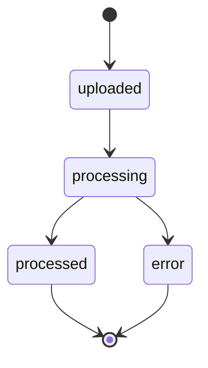

Files are the building blocks for advanced Continuum AI workflows. Upload training data for fine-tuning, documents for retrieval-augmented generation, images for vision models, or structured inputs for batch processing.

<Info>
  Uploaded files are scoped to your project and encrypted at rest. They persist until you explicitly delete them.
</Info>

---

## Authentication

All file endpoints require a project API key.

```bash
Authorization: Bearer sk-proj-...
```

---

## Supported purposes

Each file must be uploaded with a `purpose` that determines how it can be used:

| Purpose | Description | Accepted formats |
|---------|-------------|-----------------|
| `assistants` | Documents for retrieval in thread runs | `.pdf`, `.txt`, `.md`, `.docx`, `.csv`, `.json` |
| `fine-tune` | Training and validation data for fine-tuning jobs | `.jsonl` |
| `batch` | Input files for batch processing | `.jsonl` |
| `vision` | Images for vision model analysis | `.png`, `.jpg`, `.jpeg`, `.gif`, `.webp` |

<Warning>
  Maximum file size is **512 MB**. Files exceeding this limit will be rejected with a `413` status code.
</Warning>

---

## Endpoints

### Upload a file

Upload a file using multipart form data. The file is processed asynchronously — the initial response will show `status: "uploaded"`, which transitions to `"processed"` once the file is ready for use.

<ParamField body="file" type="file" required>
  The file to upload, sent as multipart form data.
</ParamField>

<ParamField body="purpose" type="string" required>
  The intended purpose of the file. One of: `assistants`, `fine-tune`, `batch`, `vision`.
</ParamField>

<CodeGroup>

```bash cURL
curl -X POST https://api.continuumai.technology/v1/files \
  -H "Authorization: Bearer sk-proj-..." \
  -F file=@training_data.jsonl \
  -F purpose=fine-tune
```

```python Python
import requests

with open("training_data.jsonl", "rb") as f:
    response = requests.post(
        "https://api.continuumai.technology/v1/files",
        headers={"Authorization": "Bearer sk-proj-..."},
        files={"file": f},
        data={"purpose": "fine-tune"}
    )

file_obj = response.json()
print(file_obj["data"]["id"])
```

</CodeGroup>

<Expandable title="Response — 201 Created">
  ```json
  {
    "data": {
      "id": "file_abc123",
      "object": "file",
      "filename": "training_data.jsonl",
      "purpose": "fine-tune",
      "bytes": 2048576,
      "status": "uploaded",
      "created_at": "2026-03-22T12:00:00Z"
    },
    "status": 201
  }
  ```
</Expandable>

---

### List files

Returns a paginated list of all files belonging to the current project.

<ParamField query="page" type="integer" default="1" optional>
  Page number for pagination.
</ParamField>

<ParamField query="pageSize" type="integer" default="20" optional>
  Number of files per page. Maximum: 100.
</ParamField>

<ParamField query="purpose" type="string" optional>
  Filter files by purpose. One of: `assistants`, `fine-tune`, `batch`, `vision`.
</ParamField>

<CodeGroup>

```bash cURL
curl "https://api.continuumai.technology/v1/files?purpose=fine-tune&page=1&pageSize=10" \
  -H "Authorization: Bearer sk-proj-..."
```

```python Python
response = requests.get(
    "https://api.continuumai.technology/v1/files",
    headers={"Authorization": "Bearer sk-proj-..."},
    params={"purpose": "fine-tune", "page": 1, "pageSize": 10}
)
```

</CodeGroup>

<Expandable title="Response — 200 OK">
  ```json
  {
    "data": [
      {
        "id": "file_abc123",
        "object": "file",
        "filename": "training_data.jsonl",
        "purpose": "fine-tune",
        "bytes": 2048576,
        "status": "processed",
        "created_at": "2026-03-22T12:00:00Z"
      },
      {
        "id": "file_def456",
        "object": "file",
        "filename": "validation_data.jsonl",
        "purpose": "fine-tune",
        "bytes": 512000,
        "status": "processed",
        "created_at": "2026-03-22T11:45:00Z"
      }
    ],
    "pagination": {
      "page": 1,
      "pageSize": 10,
      "total": 2,
      "totalPages": 1
    }
  }
  ```
</Expandable>

---

### Get file info

Retrieves metadata about a specific file. This does not return the file content — use the download endpoint for that.

<ParamField path="file_id" type="string" required>
  The unique identifier of the file.
</ParamField>

<CodeGroup>

```bash cURL
curl https://api.continuumai.technology/v1/files/file_abc123 \
  -H "Authorization: Bearer sk-proj-..."
```

```python Python
response = requests.get(
    "https://api.continuumai.technology/v1/files/file_abc123",
    headers={"Authorization": "Bearer sk-proj-..."}
)
```

</CodeGroup>

<Expandable title="Response — 200 OK">
  ```json
  {
    "data": {
      "id": "file_abc123",
      "object": "file",
      "filename": "training_data.jsonl",
      "purpose": "fine-tune",
      "bytes": 2048576,
      "status": "processed",
      "status_details": null,
      "created_at": "2026-03-22T12:00:00Z"
    },
    "status": 200
  }
  ```
</Expandable>

---

### Delete a file

Permanently deletes a file. This action cannot be undone. Files currently in use by an active fine-tuning job or batch cannot be deleted.

<ParamField path="file_id" type="string" required>
  The unique identifier of the file to delete.
</ParamField>

<CodeGroup>

```bash cURL
curl -X DELETE https://api.continuumai.technology/v1/files/file_abc123 \
  -H "Authorization: Bearer sk-proj-..."
```

```python Python
response = requests.delete(
    "https://api.continuumai.technology/v1/files/file_abc123",
    headers={"Authorization": "Bearer sk-proj-..."}
)
```

</CodeGroup>

<Expandable title="Response — 200 OK">
  ```json
  {
    "data": {
      "id": "file_abc123",
      "object": "file",
      "deleted": true
    },
    "status": 200
  }
  ```
</Expandable>

---

### Download file content

Returns the raw content of the file. The response `Content-Type` header matches the original file's MIME type.

<ParamField path="file_id" type="string" required>
  The unique identifier of the file to download.
</ParamField>

<CodeGroup>

```bash cURL
curl https://api.continuumai.technology/v1/files/file_abc123/content \
  -H "Authorization: Bearer sk-proj-..." \
  --output training_data.jsonl
```

```python Python
response = requests.get(
    "https://api.continuumai.technology/v1/files/file_abc123/content",
    headers={"Authorization": "Bearer sk-proj-..."}
)

with open("training_data.jsonl", "wb") as f:
    f.write(response.content)
```

</CodeGroup>

<Note>
  The response body is the raw file content, not a JSON envelope. The HTTP status code indicates success (`200`) or failure (`404`, `401`).
</Note>

---

## File status lifecycle



| Status | Description |
|--------|-------------|
| `uploaded` | File received and queued for processing |
| `processing` | File is being validated and indexed |
| `processed` | File is ready for use |
| `error` | Processing failed. Check `status_details` for the reason |

---

## Error codes

| Status | Code | Description |
|--------|------|-------------|
| 400 | `INVALID_PURPOSE` | The provided purpose is not supported |
| 400 | `INVALID_FILE_FORMAT` | The file format does not match the specified purpose |
| 401 | `UNAUTHORIZED` | Invalid or missing API key |
| 404 | `FILE_NOT_FOUND` | The specified file does not exist |
| 409 | `FILE_IN_USE` | The file is in use by an active job and cannot be deleted |
| 413 | `FILE_TOO_LARGE` | The file exceeds the 512 MB size limit |
| 429 | `RATE_LIMITED` | Too many requests |
