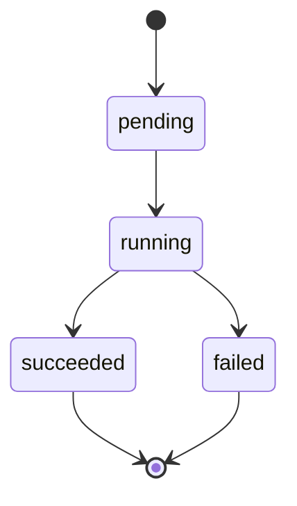

Fine-tuning lets you customize a foundation model with your own training data, producing a specialized model that understands your domain, follows your style, and delivers higher accuracy on your specific tasks — all while using fewer tokens per request.

<Info>
  Fine-tuned models are private to your project and billed at the custom model rate. Once training completes, your model is available for inference through the standard chat completions endpoint.
</Info>

---

## Authentication

All fine-tuning endpoints require a project API key.

```bash
Authorization: Bearer sk-proj-...
```

---

## The fine-tuning workflow

<Steps>
  <Step title="Prepare your training data">
    Create a JSONL file where each line is a training example in chat format. Optionally prepare a separate validation file to monitor overfitting.

    ```jsonl
    {"messages": [{"role": "system", "content": "You are a legal assistant."}, {"role": "user", "content": "Summarize this contract clause."}, {"role": "assistant", "content": "This clause establishes a 12-month non-compete..."}]}
    {"messages": [{"role": "system", "content": "You are a legal assistant."}, {"role": "user", "content": "Is this NDA enforceable?"}, {"role": "assistant", "content": "Based on the jurisdiction specified..."}]}
    ```

    <Tip>
      Aim for at least 50 high-quality training examples. For most use cases, 200-500 examples deliver strong results.
    </Tip>
  </Step>

  <Step title="Upload the training file">
    Upload your JSONL file with `purpose: fine-tune` using the [Files API](/api-reference/files).

    ```bash
    curl -X POST https://api.continuumai.technology/v1/files \
      -H "Authorization: Bearer sk-proj-..." \
      -F file=@training_data.jsonl \
      -F purpose=fine-tune
    ```
  </Step>

  <Step title="Create the fine-tuning job">
    Start training by specifying the base model and your training file. Optionally provide a validation file and hyperparameter overrides.

    ```bash
    curl -X POST https://api.continuumai.technology/v1/fine_tuning/jobs \
      -H "Authorization: Bearer sk-proj-..." \
      -H "Content-Type: application/json" \
      -d '{
        "model": "gpt-4o-mini",
        "training_file": "file_abc123",
        "validation_file": "file_def456",
        "hyperparameters": {
          "n_epochs": 3,
          "batch_size": "auto",
          "learning_rate_multiplier": "auto"
        }
      }'
    ```
  </Step>

  <Step title="Monitor training events">
    Poll the job events endpoint to track training progress, including loss metrics and validation results.

    ```bash
    curl https://api.continuumai.technology/v1/fine_tuning/jobs/ftjob_abc123/events \
      -H "Authorization: Bearer sk-proj-..."
    ```
  </Step>

  <Step title="Use your fine-tuned model">
    Once the job status is `succeeded`, the `fine_tuned_model` field contains your model identifier. Use it anywhere you would use a standard model name.

    ```bash
    curl -X POST https://api.continuumai.technology/v1/chat/completions \
      -H "Authorization: Bearer sk-proj-..." \
      -H "Content-Type: application/json" \
      -d '{
        "model": "ft:gpt-4o-mini:your-project:custom-name:abc123",
        "messages": [{"role": "user", "content": "Summarize this contract clause."}]
      }'
    ```
  </Step>
</Steps>

---

## Endpoints

### Create a fine-tuning job

<ParamField body="model" type="string" required>
  The base model to fine-tune. Supported models: `gpt-4o-mini`, `gpt-4o`, `gpt-3.5-turbo`.
</ParamField>

<ParamField body="training_file" type="string" required>
  The ID of the uploaded training file (must have `purpose: fine-tune` and `status: processed`).
</ParamField>

<ParamField body="validation_file" type="string" optional>
  The ID of an uploaded validation file for computing metrics during training.
</ParamField>

<ParamField body="hyperparameters" type="object" optional>
  Override default training hyperparameters.
</ParamField>

<Expandable title="Hyperparameters">
  <ParamField body="hyperparameters.n_epochs" type="integer | string" default="auto">
    Number of training epochs. Set to `"auto"` to let the system choose based on dataset size.
  </ParamField>

  <ParamField body="hyperparameters.batch_size" type="integer | string" default="auto">
    Batch size for training. Set to `"auto"` for automatic selection.
  </ParamField>

  <ParamField body="hyperparameters.learning_rate_multiplier" type="number | string" default="auto">
    Scaling factor for the learning rate. Set to `"auto"` for automatic tuning.
  </ParamField>
</Expandable>

<ParamField body="suffix" type="string" optional>
  A short string (up to 18 characters) appended to the fine-tuned model name for easy identification.
</ParamField>

<CodeGroup>

```bash cURL
curl -X POST https://api.continuumai.technology/v1/fine_tuning/jobs \
  -H "Authorization: Bearer sk-proj-..." \
  -H "Content-Type: application/json" \
  -d '{
    "model": "gpt-4o-mini",
    "training_file": "file_abc123",
    "validation_file": "file_def456",
    "hyperparameters": {
      "n_epochs": 3
    },
    "suffix": "legal-assistant"
  }'
```

```python Python
import requests

response = requests.post(
    "https://api.continuumai.technology/v1/fine_tuning/jobs",
    headers={"Authorization": "Bearer sk-proj-..."},
    json={
        "model": "gpt-4o-mini",
        "training_file": "file_abc123",
        "validation_file": "file_def456",
        "hyperparameters": {"n_epochs": 3},
        "suffix": "legal-assistant"
    }
)

job = response.json()
print(job["data"]["id"])
```

</CodeGroup>

<Expandable title="Response — 201 Created">
  ```json
  {
    "data": {
      "id": "ftjob_abc123",
      "object": "fine_tuning.job",
      "model": "gpt-4o-mini",
      "training_file": "file_abc123",
      "validation_file": "file_def456",
      "hyperparameters": {
        "n_epochs": 3,
        "batch_size": "auto",
        "learning_rate_multiplier": "auto"
      },
      "suffix": "legal-assistant",
      "status": "pending",
      "fine_tuned_model": null,
      "trained_tokens": null,
      "error": null,
      "created_at": "2026-03-22T14:00:00Z",
      "started_at": null,
      "completed_at": null
    },
    "status": 201
  }
  ```
</Expandable>

---

### List fine-tuning jobs

Returns a paginated list of fine-tuning jobs for the current project.

<ParamField query="page" type="integer" default="1" optional>
  Page number for pagination.
</ParamField>

<ParamField query="pageSize" type="integer" default="20" optional>
  Number of jobs per page. Maximum: 100.
</ParamField>

<CodeGroup>

```bash cURL
curl "https://api.continuumai.technology/v1/fine_tuning/jobs?page=1&pageSize=10" \
  -H "Authorization: Bearer sk-proj-..."
```

```python Python
response = requests.get(
    "https://api.continuumai.technology/v1/fine_tuning/jobs",
    headers={"Authorization": "Bearer sk-proj-..."},
    params={"page": 1, "pageSize": 10}
)
```

</CodeGroup>

<Expandable title="Response — 200 OK">
  ```json
  {
    "data": [
      {
        "id": "ftjob_abc123",
        "object": "fine_tuning.job",
        "model": "gpt-4o-mini",
        "status": "succeeded",
        "fine_tuned_model": "ft:gpt-4o-mini:your-project:legal-assistant:abc123",
        "trained_tokens": 48000,
        "created_at": "2026-03-22T14:00:00Z",
        "completed_at": "2026-03-22T15:23:00Z"
      }
    ],
    "pagination": {
      "page": 1,
      "pageSize": 10,
      "total": 1,
      "totalPages": 1
    }
  }
  ```
</Expandable>

---

### Get a fine-tuning job

Retrieves the current state of a fine-tuning job.

<ParamField path="job_id" type="string" required>
  The unique identifier of the fine-tuning job.
</ParamField>

<CodeGroup>

```bash cURL
curl https://api.continuumai.technology/v1/fine_tuning/jobs/ftjob_abc123 \
  -H "Authorization: Bearer sk-proj-..."
```

```python Python
response = requests.get(
    "https://api.continuumai.technology/v1/fine_tuning/jobs/ftjob_abc123",
    headers={"Authorization": "Bearer sk-proj-..."}
)
```

</CodeGroup>

<Expandable title="Response — 200 OK">
  ```json
  {
    "data": {
      "id": "ftjob_abc123",
      "object": "fine_tuning.job",
      "model": "gpt-4o-mini",
      "training_file": "file_abc123",
      "validation_file": "file_def456",
      "hyperparameters": {
        "n_epochs": 3,
        "batch_size": 4,
        "learning_rate_multiplier": 1.8
      },
      "suffix": "legal-assistant",
      "status": "running",
      "fine_tuned_model": null,
      "trained_tokens": 24000,
      "error": null,
      "created_at": "2026-03-22T14:00:00Z",
      "started_at": "2026-03-22T14:02:00Z",
      "completed_at": null
    },
    "status": 200
  }
  ```
</Expandable>

---

### List fine-tuning events

Returns a chronological list of events for a fine-tuning job, including training metrics and status transitions.

<ParamField path="job_id" type="string" required>
  The unique identifier of the fine-tuning job.
</ParamField>

<ParamField query="page" type="integer" default="1" optional>
  Page number for pagination.
</ParamField>

<ParamField query="pageSize" type="integer" default="20" optional>
  Number of events per page. Maximum: 100.
</ParamField>

<CodeGroup>

```bash cURL
curl "https://api.continuumai.technology/v1/fine_tuning/jobs/ftjob_abc123/events?pageSize=50" \
  -H "Authorization: Bearer sk-proj-..."
```

```python Python
response = requests.get(
    "https://api.continuumai.technology/v1/fine_tuning/jobs/ftjob_abc123/events",
    headers={"Authorization": "Bearer sk-proj-..."},
    params={"pageSize": 50}
)
```

</CodeGroup>

<Expandable title="Response — 200 OK">
  ```json
  {
    "data": [
      {
        "id": "evt_001",
        "object": "fine_tuning.event",
        "type": "status",
        "message": "Job started",
        "created_at": "2026-03-22T14:02:00Z"
      },
      {
        "id": "evt_002",
        "object": "fine_tuning.event",
        "type": "metrics",
        "data": {
          "step": 100,
          "train_loss": 0.432,
          "valid_loss": 0.498,
          "train_mean_token_accuracy": 0.876
        },
        "created_at": "2026-03-22T14:15:00Z"
      },
      {
        "id": "evt_003",
        "object": "fine_tuning.event",
        "type": "metrics",
        "data": {
          "step": 200,
          "train_loss": 0.215,
          "valid_loss": 0.301,
          "train_mean_token_accuracy": 0.934
        },
        "created_at": "2026-03-22T14:28:00Z"
      },
      {
        "id": "evt_004",
        "object": "fine_tuning.event",
        "type": "status",
        "message": "Job succeeded. Fine-tuned model: ft:gpt-4o-mini:your-project:legal-assistant:abc123",
        "created_at": "2026-03-22T15:23:00Z"
      }
    ],
    "pagination": {
      "page": 1,
      "pageSize": 50,
      "total": 4,
      "totalPages": 1
    }
  }
  ```
</Expandable>

---

## Job status lifecycle



| Status | Description |
|--------|-------------|
| `pending` | Job created and queued for training |
| `running` | Training is in progress |
| `succeeded` | Training completed. The `fine_tuned_model` field contains the model identifier |
| `failed` | Training failed. Check the `error` field for details |

<Note>
  Training duration depends on dataset size, model complexity, and number of epochs. A typical fine-tuning job on 500 examples with 3 epochs completes in 15-45 minutes.
</Note>

---

## Training data format

Each line of your JSONL file must contain a `messages` array in the standard chat format:

```jsonl
{"messages": [{"role": "system", "content": "..."}, {"role": "user", "content": "..."}, {"role": "assistant", "content": "..."}]}
```

**Requirements:**
- Each example must have at least one `user` message and one `assistant` message
- The `system` message is optional but recommended for consistent behavior
- Token count per example must not exceed the model's context window
- The file must be valid JSONL (one JSON object per line, no trailing commas)

---

## Error codes

| Status | Code | Description |
|--------|------|-------------|
| 400 | `INVALID_TRAINING_FILE` | The training file is not valid JSONL or has formatting errors |
| 400 | `UNSUPPORTED_MODEL` | The specified base model does not support fine-tuning |
| 401 | `UNAUTHORIZED` | Invalid or missing API key |
| 404 | `JOB_NOT_FOUND` | The specified fine-tuning job does not exist |
| 409 | `JOB_LIMIT_REACHED` | Maximum concurrent fine-tuning jobs exceeded |
| 429 | `RATE_LIMITED` | Too many requests |
