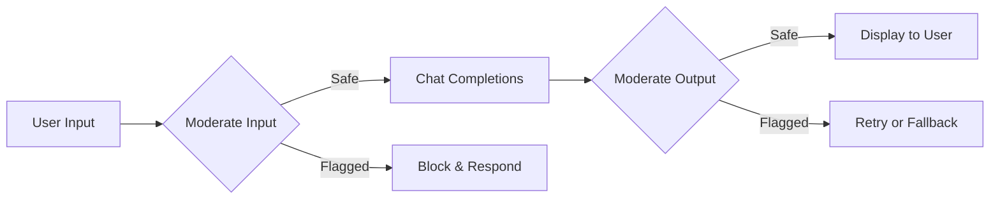

The Moderations API analyzes text for content that may violate usage policies, enabling you to build safety layers into your application. Each request returns category-level flags and granular confidence scores, giving you the flexibility to enforce your own thresholds.

<Info>
  Moderation checks are fast and lightweight. Run them on user inputs before sending them to a model, on model outputs before displaying them, or both — the latency overhead is minimal.
</Info>

---

## Authentication

```bash
Authorization: Bearer sk-proj-...
```

---

## Use cases

<CardGroup cols={2}>
  <Card title="Input filtering" icon="filter">
    Screen user messages before they reach your LLM to prevent prompt injection, harmful content generation, or policy violations.
  </Card>
  <Card title="Output validation" icon="check-double">
    Verify model responses before displaying them to end users, catching edge cases where the model may produce inappropriate content.
  </Card>
  <Card title="Content pipelines" icon="conveyor-belt">
    Add moderation as a step in automated content workflows — flag, quarantine, or route content based on category scores.
  </Card>
  <Card title="Compliance logging" icon="clipboard-list">
    Log moderation results alongside API calls for audit trails and regulatory compliance.
  </Card>
</CardGroup>

---

## Create a moderation

Analyzes the provided input text and returns a detailed breakdown of content categories with binary flags and confidence scores.

### `POST /v1/moderations`

<ParamField body="input" type="string | array" required>
  The text to classify. Pass a single string or an array of strings to moderate multiple inputs in one request (up to 32 items per batch).
</ParamField>

<ParamField body="model" type="string" default="continuum-shield" optional>
  The moderation model to use. Currently available: `continuum-shield`, `continuum-shield-stable`.
</ParamField>

<CodeGroup>

```bash cURL
curl -X POST https://api.continuumai.technology/v1/moderations \
  -H "Authorization: Bearer sk-proj-..." \
  -H "Content-Type: application/json" \
  -d '{
    "input": "I want to learn how to build a web application with React.",
    "model": "continuum-shield"
  }'
```

```python Python
import requests

response = requests.post(
    "https://api.continuumai.technology/v1/moderations",
    headers={"Authorization": "Bearer sk-proj-..."},
    json={
        "input": "I want to learn how to build a web application with React.",
        "model": "continuum-shield"
    }
)

moderation = response.json()
flagged = moderation["data"]["results"][0]["flagged"]
```

</CodeGroup>

<Expandable title="Response — 200 OK (single input)">
  ```json
  {
    "data": {
      "id": "mod_abc123",
      "model": "continuum-shield",
      "results": [
        {
          "flagged": false,
          "categories": {
            "hate": false,
            "hate/threatening": false,
            "harassment": false,
            "harassment/threatening": false,
            "self-harm": false,
            "self-harm/intent": false,
            "self-harm/instructions": false,
            "sexual": false,
            "sexual/minors": false,
            "violence": false,
            "violence/graphic": false
          },
          "category_scores": {
            "hate": 0.00012,
            "hate/threatening": 0.00001,
            "harassment": 0.00034,
            "harassment/threatening": 0.00002,
            "self-harm": 0.00001,
            "self-harm/intent": 0.00000,
            "self-harm/instructions": 0.00000,
            "sexual": 0.00008,
            "sexual/minors": 0.00000,
            "violence": 0.00005,
            "violence/graphic": 0.00001
          }
        }
      ]
    },
    "status": 200
  }
  ```
</Expandable>

---

### Batch moderation

Moderate multiple inputs in a single request by passing an array of strings.

<CodeGroup>

```bash cURL
curl -X POST https://api.continuumai.technology/v1/moderations \
  -H "Authorization: Bearer sk-proj-..." \
  -H "Content-Type: application/json" \
  -d '{
    "input": [
      "How do I bake a chocolate cake?",
      "This is a perfectly normal question about gardening."
    ],
    "model": "continuum-shield"
  }'
```

```python Python
response = requests.post(
    "https://api.continuumai.technology/v1/moderations",
    headers={"Authorization": "Bearer sk-proj-..."},
    json={
        "input": [
            "How do I bake a chocolate cake?",
            "This is a perfectly normal question about gardening."
        ],
        "model": "continuum-shield"
    }
)

results = response.json()["data"]["results"]
for i, result in enumerate(results):
    print(f"Input {i}: flagged={result['flagged']}")
```

</CodeGroup>

<Expandable title="Response — 200 OK (batch)">
  ```json
  {
    "data": {
      "id": "mod_def456",
      "model": "continuum-shield",
      "results": [
        {
          "flagged": false,
          "categories": {
            "hate": false,
            "harassment": false,
            "self-harm": false,
            "sexual": false,
            "violence": false
          },
          "category_scores": {
            "hate": 0.00003,
            "harassment": 0.00011,
            "self-harm": 0.00000,
            "sexual": 0.00002,
            "violence": 0.00001
          }
        },
        {
          "flagged": false,
          "categories": {
            "hate": false,
            "harassment": false,
            "self-harm": false,
            "sexual": false,
            "violence": false
          },
          "category_scores": {
            "hate": 0.00001,
            "harassment": 0.00005,
            "self-harm": 0.00000,
            "sexual": 0.00001,
            "violence": 0.00002
          }
        }
      ]
    },
    "status": 200
  }
  ```
</Expandable>

---

## Categories reference

| Category | Description |
|----------|-------------|
| `hate` | Content that expresses or promotes hate based on race, gender, ethnicity, religion, nationality, sexual orientation, disability, or caste |
| `hate/threatening` | Hateful content that includes threats of violence or serious harm |
| `harassment` | Content that targets, demeans, or bullies an individual or group |
| `harassment/threatening` | Harassment content that includes threats of violence or serious harm |
| `self-harm` | Content that promotes, encourages, or depicts acts of self-harm |
| `self-harm/intent` | Content where the speaker expresses intent to engage in self-harm |
| `self-harm/instructions` | Content that provides instructions for self-harm |
| `sexual` | Content intended to arouse sexual excitement or that describes sexual activity |
| `sexual/minors` | Sexual content involving individuals under 18 years old |
| `violence` | Content that depicts or promotes violence against people or animals |
| `violence/graphic` | Content that depicts violence with graphic detail |

---

## Working with scores

The `category_scores` object contains confidence values between `0.0` and `1.0` for each category. The `flagged` boolean and category booleans use Continuum AI's default thresholds, but you can implement custom logic based on the raw scores.

```python
# Example: Custom threshold logic
CUSTOM_THRESHOLDS = {
    "hate": 0.5,
    "harassment": 0.6,
    "violence": 0.7,
}

result = moderation["data"]["results"][0]

for category, threshold in CUSTOM_THRESHOLDS.items():
    score = result["category_scores"][category]
    if score > threshold:
        print(f"BLOCKED: {category} score {score:.4f} exceeds threshold {threshold}")
```

<Tip>
  Start with the default `flagged` field for quick integration. As you collect data on false positives and negatives in your specific use case, tune the thresholds using `category_scores` for more precise control.
</Tip>

---

## Integration pattern



A typical safety pipeline moderates both the user's input and the model's output:

<Steps>
  <Step title="Moderate user input">
    Before sending the user's message to the model, run it through the moderations endpoint. If flagged, return a safe response instead of calling the model.
  </Step>

  <Step title="Generate model response">
    If the input passes moderation, send it to the chat completions endpoint as normal.
  </Step>

  <Step title="Moderate model output">
    Before displaying the model's response, run it through moderation. If flagged, either retry with adjusted parameters or return a fallback message.
  </Step>
</Steps>

```python
# Complete safety pipeline
def safe_generate(user_message):
    # Step 1: Check input
    mod_input = requests.post(
        "https://api.continuumai.technology/v1/moderations",
        headers={"Authorization": "Bearer sk-proj-..."},
        json={"input": user_message}
    ).json()

    if mod_input["data"]["results"][0]["flagged"]:
        return "I'm unable to process that request."

    # Step 2: Generate response
    completion = requests.post(
        "https://api.continuumai.technology/v1/chat/completions",
        headers={"Authorization": "Bearer sk-proj-..."},
        json={
            "model": "continuum-ultra",
            "messages": [{"role": "user", "content": user_message}]
        }
    ).json()

    assistant_message = completion["choices"][0]["message"]["content"]

    # Step 3: Check output
    mod_output = requests.post(
        "https://api.continuumai.technology/v1/moderations",
        headers={"Authorization": "Bearer sk-proj-..."},
        json={"input": assistant_message}
    ).json()

    if mod_output["data"]["results"][0]["flagged"]:
        return "The response was filtered for safety. Please try rephrasing your question."

    return assistant_message
```

---

## Error codes

| Status | Code | Description |
|--------|------|-------------|
| 400 | `INVALID_INPUT` | The `input` field is missing, empty, or exceeds the 32-item batch limit |
| 401 | `UNAUTHORIZED` | Invalid or missing API key |
| 422 | `UNSUPPORTED_MODEL` | The specified moderation model does not exist |
| 429 | `RATE_LIMITED` | Too many requests |
| 500 | `INTERNAL_ERROR` | An unexpected error occurred |
