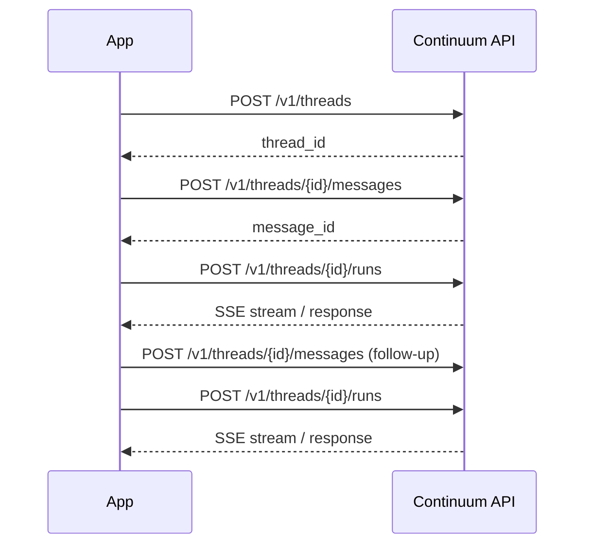

Threads represent persistent conversations between your application and Continuum AI models. Each thread maintains its own message history, allowing you to build stateful, multi-turn interactions without managing context yourself.

<Info>
  Threads are scoped to your project. Each thread persists until explicitly deleted, and all messages within a thread are available for context during runs.
</Info>

---

## Authentication

All thread endpoints require a project API key passed via the `Authorization` header.

```bash
Authorization: Bearer sk-proj-...
```

---

## Endpoints

<Tabs>
  <Tab title="Threads">

    ### Create a thread

    <ParamField body="metadata" type="object" optional>
      Set of key-value pairs for storing additional information about the thread. Up to 16 keys, with key names up to 64 characters and values up to 512 characters.
    </ParamField>

    <CodeGroup>

    ```bash cURL
    curl -X POST https://api.continuumai.technology/v1/threads \
      -H "Authorization: Bearer sk-proj-..." \
      -H "Content-Type: application/json" \
      -d '{
        "metadata": {
          "user_id": "usr_abc123",
          "session": "onboarding"
        }
      }'
    ```

    ```python Python
    import requests

    response = requests.post(
        "https://api.continuumai.technology/v1/threads",
        headers={"Authorization": "Bearer sk-proj-..."},
        json={
            "metadata": {
                "user_id": "usr_abc123",
                "session": "onboarding"
            }
        }
    )

    thread = response.json()
    print(thread["data"]["id"])
    ```

    </CodeGroup>

    <Expandable title="Response — 201 Created">
      ```json
      {
        "data": {
          "id": "thread_abc123def456",
          "object": "thread",
          "created_at": "2026-03-22T10:30:00Z",
          "metadata": {
            "user_id": "usr_abc123",
            "session": "onboarding"
          }
        },
        "status": 201
      }
      ```
    </Expandable>

    ---

    ### List threads

    Returns a paginated list of threads for the current project.

    <ParamField query="page" type="integer" default="1" optional>
      Page number for pagination.
    </ParamField>

    <ParamField query="pageSize" type="integer" default="20" optional>
      Number of threads per page. Maximum: 100.
    </ParamField>

    <CodeGroup>

    ```bash cURL
    curl https://api.continuumai.technology/v1/threads?page=1&pageSize=20 \
      -H "Authorization: Bearer sk-proj-..."
    ```

    ```python Python
    response = requests.get(
        "https://api.continuumai.technology/v1/threads",
        headers={"Authorization": "Bearer sk-proj-..."},
        params={"page": 1, "pageSize": 20}
    )

    threads = response.json()
    ```

    </CodeGroup>

    <Expandable title="Response — 200 OK">
      ```json
      {
        "data": [
          {
            "id": "thread_abc123def456",
            "object": "thread",
            "created_at": "2026-03-22T10:30:00Z",
            "metadata": {
              "user_id": "usr_abc123",
              "session": "onboarding"
            }
          }
        ],
        "pagination": {
          "page": 1,
          "pageSize": 20,
          "total": 42,
          "totalPages": 3
        }
      }
      ```
    </Expandable>

    ---

    ### Get a thread

    Retrieves a single thread by its ID.

    <ParamField path="thread_id" type="string" required>
      The unique identifier of the thread.
    </ParamField>

    <CodeGroup>

    ```bash cURL
    curl https://api.continuumai.technology/v1/threads/thread_abc123def456 \
      -H "Authorization: Bearer sk-proj-..."
    ```

    ```python Python
    response = requests.get(
        "https://api.continuumai.technology/v1/threads/thread_abc123def456",
        headers={"Authorization": "Bearer sk-proj-..."}
    )
    ```

    </CodeGroup>

    <Expandable title="Response — 200 OK">
      ```json
      {
        "data": {
          "id": "thread_abc123def456",
          "object": "thread",
          "created_at": "2026-03-22T10:30:00Z",
          "metadata": {
            "user_id": "usr_abc123",
            "session": "onboarding"
          }
        },
        "status": 200
      }
      ```
    </Expandable>

    ---

    ### Update a thread

    Modifies the metadata of an existing thread. Only the fields you provide will be updated.

    <ParamField path="thread_id" type="string" required>
      The unique identifier of the thread to update.
    </ParamField>

    <ParamField body="metadata" type="object" required>
      Updated key-value pairs. Keys set to `null` will be removed.
    </ParamField>

    <CodeGroup>

    ```bash cURL
    curl -X PATCH https://api.continuumai.technology/v1/threads/thread_abc123def456 \
      -H "Authorization: Bearer sk-proj-..." \
      -H "Content-Type: application/json" \
      -d '{
        "metadata": {
          "session": "completed",
          "resolved": "true"
        }
      }'
    ```

    ```python Python
    response = requests.patch(
        "https://api.continuumai.technology/v1/threads/thread_abc123def456",
        headers={"Authorization": "Bearer sk-proj-..."},
        json={
            "metadata": {
                "session": "completed",
                "resolved": "true"
            }
        }
    )
    ```

    </CodeGroup>

    <Expandable title="Response — 200 OK">
      ```json
      {
        "data": {
          "id": "thread_abc123def456",
          "object": "thread",
          "created_at": "2026-03-22T10:30:00Z",
          "metadata": {
            "user_id": "usr_abc123",
            "session": "completed",
            "resolved": "true"
          }
        },
        "status": 200
      }
      ```
    </Expandable>

    ---

    ### Delete a thread

    Soft-deletes a thread. The thread will no longer appear in list responses, but its data is retained for 30 days before permanent deletion.

    <ParamField path="thread_id" type="string" required>
      The unique identifier of the thread to delete.
    </ParamField>

    <CodeGroup>

    ```bash cURL
    curl -X DELETE https://api.continuumai.technology/v1/threads/thread_abc123def456 \
      -H "Authorization: Bearer sk-proj-..."
    ```

    ```python Python
    response = requests.delete(
        "https://api.continuumai.technology/v1/threads/thread_abc123def456",
        headers={"Authorization": "Bearer sk-proj-..."}
    )
    ```

    </CodeGroup>

    <Expandable title="Response — 200 OK">
      ```json
      {
        "data": {
          "id": "thread_abc123def456",
          "object": "thread",
          "deleted": true
        },
        "status": 200
      }
      ```
    </Expandable>

  </Tab>

  <Tab title="Messages">

    ### Add a message

    Appends a message to a thread. Messages represent individual turns in the conversation and can include tool call information for function-calling workflows.

    <ParamField path="thread_id" type="string" required>
      The thread to add the message to.
    </ParamField>

    <ParamField body="role" type="string" required>
      The role of the message author. One of `user`, `assistant`, or `tool`.
    </ParamField>

    <ParamField body="content" type="string" required>
      The text content of the message.
    </ParamField>

    <ParamField body="tool_calls" type="array" optional>
      An array of tool call objects when the assistant invokes tools. Each object includes `id`, `type`, `function.name`, and `function.arguments`.
    </ParamField>

    <ParamField body="tool_call_id" type="string" optional>
      The ID of the tool call this message is responding to. Required when `role` is `tool`.
    </ParamField>

    <CodeGroup>

    ```bash cURL
    curl -X POST https://api.continuumai.technology/v1/threads/thread_abc123def456/messages \
      -H "Authorization: Bearer sk-proj-..." \
      -H "Content-Type: application/json" \
      -d '{
        "role": "user",
        "content": "What are the top 3 benefits of using a vector database?"
      }'
    ```

    ```python Python
    response = requests.post(
        "https://api.continuumai.technology/v1/threads/thread_abc123def456/messages",
        headers={"Authorization": "Bearer sk-proj-..."},
        json={
            "role": "user",
            "content": "What are the top 3 benefits of using a vector database?"
        }
    )

    message = response.json()
    ```

    </CodeGroup>

    <Expandable title="Response — 201 Created">
      ```json
      {
        "data": {
          "id": "msg_xyz789",
          "object": "message",
          "thread_id": "thread_abc123def456",
          "role": "user",
          "content": "What are the top 3 benefits of using a vector database?",
          "tool_calls": null,
          "tool_call_id": null,
          "created_at": "2026-03-22T10:31:00Z"
        },
        "status": 201
      }
      ```
    </Expandable>

    ---

    ### List messages

    Returns a paginated list of messages in a thread, ordered chronologically.

    <ParamField path="thread_id" type="string" required>
      The thread to retrieve messages from.
    </ParamField>

    <ParamField query="page" type="integer" default="1" optional>
      Page number for pagination.
    </ParamField>

    <ParamField query="pageSize" type="integer" default="20" optional>
      Number of messages per page. Maximum: 100.
    </ParamField>

    <CodeGroup>

    ```bash cURL
    curl "https://api.continuumai.technology/v1/threads/thread_abc123def456/messages?page=1&pageSize=50" \
      -H "Authorization: Bearer sk-proj-..."
    ```

    ```python Python
    response = requests.get(
        "https://api.continuumai.technology/v1/threads/thread_abc123def456/messages",
        headers={"Authorization": "Bearer sk-proj-..."},
        params={"page": 1, "pageSize": 50}
    )

    messages = response.json()
    ```

    </CodeGroup>

    <Expandable title="Response — 200 OK">
      ```json
      {
        "data": [
          {
            "id": "msg_xyz789",
            "object": "message",
            "thread_id": "thread_abc123def456",
            "role": "user",
            "content": "What are the top 3 benefits of using a vector database?",
            "tool_calls": null,
            "tool_call_id": null,
            "created_at": "2026-03-22T10:31:00Z"
          },
          {
            "id": "msg_xyz790",
            "object": "message",
            "thread_id": "thread_abc123def456",
            "role": "assistant",
            "content": "Here are the top 3 benefits of using a vector database...",
            "tool_calls": null,
            "tool_call_id": null,
            "created_at": "2026-03-22T10:31:05Z"
          }
        ],
        "pagination": {
          "page": 1,
          "pageSize": 50,
          "total": 2,
          "totalPages": 1
        }
      }
      ```
    </Expandable>

  </Tab>

  <Tab title="Runs">

    ### Create a run

    Triggers the AI model to generate a response based on the thread's message history. You can configure the model, sampling parameters, tool definitions, and additional system-level instructions.

    <ParamField path="thread_id" type="string" required>
      The thread to run the model against.
    </ParamField>

    <ParamField body="model" type="string" required>
      The model to use for generation. Examples: `continuum-ultra`, `continuum-lite`, `continuum-turbo`.
    </ParamField>

    <ParamField body="temperature" type="number" default="1.0" optional>
      Sampling temperature between 0 and 2. Lower values produce more focused output.
    </ParamField>

    <ParamField body="max_tokens" type="integer" optional>
      Maximum number of tokens to generate. Defaults to the model's maximum.
    </ParamField>

    <ParamField body="tools" type="array" optional>
      A list of tool definitions the model may call. Each tool includes a `type` (`function`) and a `function` object with `name`, `description`, and `parameters`.
    </ParamField>

    <ParamField body="additional_instructions" type="string" optional>
      Extra system-level instructions appended to the model's context for this run only.
    </ParamField>

    <ParamField body="stream" type="boolean" default="false" optional>
      When `true`, the response is delivered as a stream of server-sent events (SSE).
    </ParamField>

    <Tip>
      Set `stream: true` to receive tokens as they are generated. This dramatically reduces perceived latency for end users and is recommended for all interactive applications.
    </Tip>

    <CodeGroup>

    ```bash cURL
    curl -X POST https://api.continuumai.technology/v1/threads/thread_abc123def456/runs \
      -H "Authorization: Bearer sk-proj-..." \
      -H "Content-Type: application/json" \
      -d '{
        "model": "continuum-ultra",
        "temperature": 0.7,
        "max_tokens": 1024,
        "additional_instructions": "Respond concisely in bullet points.",
        "stream": false
      }'
    ```

    ```python Python
    response = requests.post(
        "https://api.continuumai.technology/v1/threads/thread_abc123def456/runs",
        headers={"Authorization": "Bearer sk-proj-..."},
        json={
            "model": "continuum-ultra",
            "temperature": 0.7,
            "max_tokens": 1024,
            "additional_instructions": "Respond concisely in bullet points.",
            "stream": False
        }
    )

    run = response.json()
    ```

    </CodeGroup>

    <Expandable title="Response — 200 OK (non-streaming)">
      ```json
      {
        "data": {
          "id": "run_001",
          "object": "run",
          "thread_id": "thread_abc123def456",
          "model": "continuum-ultra",
          "status": "completed",
          "usage": {
            "prompt_tokens": 85,
            "completion_tokens": 210,
            "total_tokens": 295
          },
          "message": {
            "id": "msg_xyz791",
            "role": "assistant",
            "content": "Here are the top 3 benefits of using a vector database:\n\n- **Semantic search**: Find results based on meaning, not just keywords...\n- **Scalability**: Handle billions of vectors with sub-second query times...\n- **Multimodal support**: Store and query across text, images, and audio..."
          },
          "created_at": "2026-03-22T10:31:10Z",
          "completed_at": "2026-03-22T10:31:14Z"
        },
        "status": 200
      }
      ```
    </Expandable>

    <Expandable title="Response — 200 OK (streaming)">
      When `stream: true`, the response is delivered as server-sent events:

      ```
      data: {"id":"run_001","object":"run.step","delta":{"content":"Here"}}

      data: {"id":"run_001","object":"run.step","delta":{"content":" are"}}

      data: {"id":"run_001","object":"run.step","delta":{"content":" the"}}

      ...

      data: {"id":"run_001","object":"run.completed","usage":{"prompt_tokens":85,"completion_tokens":210,"total_tokens":295}}

      data: [DONE]
      ```
    </Expandable>

    #### Streaming with Python

    ```python
    import requests

    response = requests.post(
        "https://api.continuumai.technology/v1/threads/thread_abc123def456/runs",
        headers={"Authorization": "Bearer sk-proj-..."},
        json={"model": "continuum-ultra", "stream": True},
        stream=True
    )

    for line in response.iter_lines():
        if line:
            decoded = line.decode("utf-8")
            if decoded.startswith("data: ") and decoded != "data: [DONE]":
                print(decoded[6:])
    ```

    #### Runs with tool calling

    ```bash
    curl -X POST https://api.continuumai.technology/v1/threads/thread_abc123def456/runs \
      -H "Authorization: Bearer sk-proj-..." \
      -H "Content-Type: application/json" \
      -d '{
        "model": "continuum-ultra",
        "tools": [
          {
            "type": "function",
            "function": {
              "name": "get_weather",
              "description": "Get the current weather for a location",
              "parameters": {
                "type": "object",
                "properties": {
                  "location": {
                    "type": "string",
                    "description": "City and state, e.g. San Francisco, CA"
                  }
                },
                "required": ["location"]
              }
            }
          }
        ]
      }'
    ```

  </Tab>
</Tabs>

---

## Conversation flow



Build a complete multi-turn conversation in four steps:

<Steps>
  <Step title="Create a thread">
    Start a new conversation by creating a thread. Optionally attach metadata to associate the thread with a user, session, or any context your application needs.

    ```bash
    curl -X POST https://api.continuumai.technology/v1/threads \
      -H "Authorization: Bearer sk-proj-..." \
      -H "Content-Type: application/json" \
      -d '{"metadata": {"user_id": "usr_abc123"}}'
    ```
  </Step>

  <Step title="Add a user message">
    Post the user's input as a message to the thread. The message is persisted and becomes part of the conversation context.

    ```bash
    curl -X POST https://api.continuumai.technology/v1/threads/thread_abc123def456/messages \
      -H "Authorization: Bearer sk-proj-..." \
      -H "Content-Type: application/json" \
      -d '{"role": "user", "content": "Explain quantum computing in simple terms."}'
    ```
  </Step>

  <Step title="Run the model">
    Create a run to generate the AI response. The model reads the entire thread history and produces a contextually aware reply.

    ```bash
    curl -X POST https://api.continuumai.technology/v1/threads/thread_abc123def456/runs \
      -H "Authorization: Bearer sk-proj-..." \
      -H "Content-Type: application/json" \
      -d '{"model": "continuum-ultra", "temperature": 0.7}'
    ```
  </Step>

  <Step title="Retrieve the response">
    The run response includes the assistant's generated message. For subsequent turns, repeat steps 2-3. The thread automatically maintains the full conversation history.

    ```bash
    curl https://api.continuumai.technology/v1/threads/thread_abc123def456/messages?page=1&pageSize=50 \
      -H "Authorization: Bearer sk-proj-..."
    ```
  </Step>
</Steps>

---

## Error codes

| Status | Code | Description |
|--------|------|-------------|
| 400 | `INVALID_REQUEST` | Missing required fields or invalid parameter values |
| 401 | `UNAUTHORIZED` | Invalid or missing API key |
| 404 | `THREAD_NOT_FOUND` | The specified thread does not exist or has been deleted |
| 404 | `MESSAGE_NOT_FOUND` | The specified message does not exist |
| 429 | `RATE_LIMITED` | Too many requests. Retry after the period indicated in the `Retry-After` header |
| 500 | `INTERNAL_ERROR` | An unexpected error occurred on our end |
