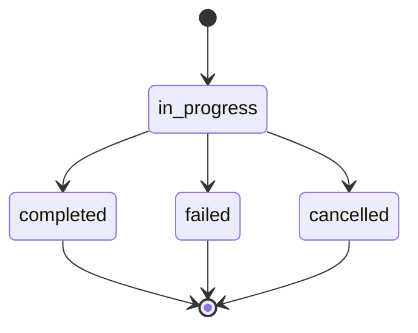

Vector stores let you build persistent, searchable knowledge bases from your files. Once files are added to a vector store, their content is automatically chunked, embedded, and indexed — making it instantly available for semantic search during thread runs.

<Info>
  Vector stores support automatic file processing. When you add a file, it is chunked and embedded in the background. Check the file's `status` field to know when it is ready for queries.
</Info>

---

## Authentication

All vector store endpoints require a project API key.

```bash
Authorization: Bearer sk-proj-...
```

---

## Endpoints

<Tabs>
  <Tab title="Stores">

    ### Create a vector store

    <ParamField body="name" type="string" required>
      A human-readable name for the vector store.
    </ParamField>

    <ParamField body="file_ids" type="array" optional>
      An array of file IDs to add to the store on creation. Files must have `purpose: assistants` and `status: processed`.
    </ParamField>

    <ParamField body="metadata" type="object" optional>
      Key-value pairs for storing additional information. Up to 16 keys.
    </ParamField>

    <ParamField body="expires_after" type="object" optional>
      Expiration policy for the vector store. Contains `anchor` (currently only `"last_active_at"`) and `days` (integer).
    </ParamField>

    <CodeGroup>

    ```bash cURL
    curl -X POST https://api.continuumai.technology/v1/vector_stores \
      -H "Authorization: Bearer sk-proj-..." \
      -H "Content-Type: application/json" \
      -d '{
        "name": "Product Documentation",
        "file_ids": ["file_abc123", "file_def456"],
        "metadata": {
          "version": "2.0",
          "department": "engineering"
        }
      }'
    ```

    ```python Python
    import requests

    response = requests.post(
        "https://api.continuumai.technology/v1/vector_stores",
        headers={"Authorization": "Bearer sk-proj-..."},
        json={
            "name": "Product Documentation",
            "file_ids": ["file_abc123", "file_def456"],
            "metadata": {
                "version": "2.0",
                "department": "engineering"
            }
        }
    )

    store = response.json()
    print(store["data"]["id"])
    ```

    </CodeGroup>

    <Expandable title="Response — 201 Created">
      ```json
      {
        "data": {
          "id": "vs_abc123",
          "object": "vector_store",
          "name": "Product Documentation",
          "status": "completed",
          "file_counts": {
            "in_progress": 0,
            "completed": 2,
            "failed": 0,
            "cancelled": 0,
            "total": 2
          },
          "usage_bytes": 1048576,
          "metadata": {
            "version": "2.0",
            "department": "engineering"
          },
          "expires_after": null,
          "expires_at": null,
          "created_at": "2026-03-22T16:00:00Z",
          "last_active_at": "2026-03-22T16:00:00Z"
        },
        "status": 201
      }
      ```
    </Expandable>

    ---

    ### List vector stores

    Returns a paginated list of all vector stores in the current project.

    <ParamField query="page" type="integer" default="1" optional>
      Page number for pagination.
    </ParamField>

    <ParamField query="pageSize" type="integer" default="20" optional>
      Number of stores per page. Maximum: 100.
    </ParamField>

    <CodeGroup>

    ```bash cURL
    curl "https://api.continuumai.technology/v1/vector_stores?page=1&pageSize=20" \
      -H "Authorization: Bearer sk-proj-..."
    ```

    ```python Python
    response = requests.get(
        "https://api.continuumai.technology/v1/vector_stores",
        headers={"Authorization": "Bearer sk-proj-..."},
        params={"page": 1, "pageSize": 20}
    )
    ```

    </CodeGroup>

    <Expandable title="Response — 200 OK">
      ```json
      {
        "data": [
          {
            "id": "vs_abc123",
            "object": "vector_store",
            "name": "Product Documentation",
            "status": "completed",
            "file_counts": {
              "in_progress": 0,
              "completed": 2,
              "failed": 0,
              "cancelled": 0,
              "total": 2
            },
            "usage_bytes": 1048576,
            "created_at": "2026-03-22T16:00:00Z"
          }
        ],
        "pagination": {
          "page": 1,
          "pageSize": 20,
          "total": 1,
          "totalPages": 1
        }
      }
      ```
    </Expandable>

    ---

    ### Get a vector store

    <ParamField path="vs_id" type="string" required>
      The unique identifier of the vector store.
    </ParamField>

    <CodeGroup>

    ```bash cURL
    curl https://api.continuumai.technology/v1/vector_stores/vs_abc123 \
      -H "Authorization: Bearer sk-proj-..."
    ```

    ```python Python
    response = requests.get(
        "https://api.continuumai.technology/v1/vector_stores/vs_abc123",
        headers={"Authorization": "Bearer sk-proj-..."}
    )
    ```

    </CodeGroup>

    <Expandable title="Response — 200 OK">
      ```json
      {
        "data": {
          "id": "vs_abc123",
          "object": "vector_store",
          "name": "Product Documentation",
          "status": "completed",
          "file_counts": {
            "in_progress": 0,
            "completed": 2,
            "failed": 0,
            "cancelled": 0,
            "total": 2
          },
          "usage_bytes": 1048576,
          "metadata": {
            "version": "2.0",
            "department": "engineering"
          },
          "expires_after": null,
          "expires_at": null,
          "created_at": "2026-03-22T16:00:00Z",
          "last_active_at": "2026-03-22T16:05:00Z"
        },
        "status": 200
      }
      ```
    </Expandable>

    ---

    ### Delete a vector store

    Permanently deletes a vector store and removes all associated embeddings. The source files are not deleted.

    <ParamField path="vs_id" type="string" required>
      The unique identifier of the vector store to delete.
    </ParamField>

    <CodeGroup>

    ```bash cURL
    curl -X DELETE https://api.continuumai.technology/v1/vector_stores/vs_abc123 \
      -H "Authorization: Bearer sk-proj-..."
    ```

    ```python Python
    response = requests.delete(
        "https://api.continuumai.technology/v1/vector_stores/vs_abc123",
        headers={"Authorization": "Bearer sk-proj-..."}
    )
    ```

    </CodeGroup>

    <Expandable title="Response — 200 OK">
      ```json
      {
        "data": {
          "id": "vs_abc123",
          "object": "vector_store",
          "deleted": true
        },
        "status": 200
      }
      ```
    </Expandable>

  </Tab>

  <Tab title="Store files">

    ### Add a file to a vector store

    Adds an existing file to a vector store. The file is automatically chunked and embedded. Processing happens asynchronously — poll the file status to know when it is ready.

    <ParamField path="vs_id" type="string" required>
      The vector store to add the file to.
    </ParamField>

    <ParamField body="file_id" type="string" required>
      The ID of the file to add. Must have `purpose: assistants` and `status: processed`.
    </ParamField>

    <ParamField body="chunking_strategy" type="object" optional>
      Override the default chunking behavior. Contains `type` (`"auto"` or `"static"`) and, for static, `max_chunk_size_tokens` and `chunk_overlap_tokens`.
    </ParamField>

    <CodeGroup>

    ```bash cURL
    curl -X POST https://api.continuumai.technology/v1/vector_stores/vs_abc123/files \
      -H "Authorization: Bearer sk-proj-..." \
      -H "Content-Type: application/json" \
      -d '{
        "file_id": "file_ghi789"
      }'
    ```

    ```python Python
    response = requests.post(
        "https://api.continuumai.technology/v1/vector_stores/vs_abc123/files",
        headers={"Authorization": "Bearer sk-proj-..."},
        json={"file_id": "file_ghi789"}
    )
    ```

    </CodeGroup>

    <Expandable title="Response — 201 Created">
      ```json
      {
        "data": {
          "id": "vsfile_001",
          "object": "vector_store.file",
          "vector_store_id": "vs_abc123",
          "file_id": "file_ghi789",
          "status": "in_progress",
          "chunking_strategy": {
            "type": "auto"
          },
          "created_at": "2026-03-22T16:10:00Z"
        },
        "status": 201
      }
      ```
    </Expandable>

    ---

    ### List store files

    Returns a paginated list of files in a vector store.

    <ParamField path="vs_id" type="string" required>
      The vector store to list files from.
    </ParamField>

    <ParamField query="page" type="integer" default="1" optional>
      Page number for pagination.
    </ParamField>

    <ParamField query="pageSize" type="integer" default="20" optional>
      Number of files per page. Maximum: 100.
    </ParamField>

    <ParamField query="status" type="string" optional>
      Filter by file status. One of: `in_progress`, `completed`, `failed`, `cancelled`.
    </ParamField>

    <CodeGroup>

    ```bash cURL
    curl "https://api.continuumai.technology/v1/vector_stores/vs_abc123/files?status=completed" \
      -H "Authorization: Bearer sk-proj-..."
    ```

    ```python Python
    response = requests.get(
        "https://api.continuumai.technology/v1/vector_stores/vs_abc123/files",
        headers={"Authorization": "Bearer sk-proj-..."},
        params={"status": "completed"}
    )
    ```

    </CodeGroup>

    <Expandable title="Response — 200 OK">
      ```json
      {
        "data": [
          {
            "id": "vsfile_001",
            "object": "vector_store.file",
            "vector_store_id": "vs_abc123",
            "file_id": "file_ghi789",
            "status": "completed",
            "usage_bytes": 524288,
            "chunking_strategy": {
              "type": "auto"
            },
            "created_at": "2026-03-22T16:10:00Z"
          }
        ],
        "pagination": {
          "page": 1,
          "pageSize": 20,
          "total": 3,
          "totalPages": 1
        }
      }
      ```
    </Expandable>

    ---

    ### Get a store file

    <ParamField path="vs_id" type="string" required>
      The vector store ID.
    </ParamField>

    <ParamField path="file_id" type="string" required>
      The vector store file ID.
    </ParamField>

    <CodeGroup>

    ```bash cURL
    curl https://api.continuumai.technology/v1/vector_stores/vs_abc123/files/vsfile_001 \
      -H "Authorization: Bearer sk-proj-..."
    ```

    ```python Python
    response = requests.get(
        "https://api.continuumai.technology/v1/vector_stores/vs_abc123/files/vsfile_001",
        headers={"Authorization": "Bearer sk-proj-..."}
    )
    ```

    </CodeGroup>

    <Expandable title="Response — 200 OK">
      ```json
      {
        "data": {
          "id": "vsfile_001",
          "object": "vector_store.file",
          "vector_store_id": "vs_abc123",
          "file_id": "file_ghi789",
          "status": "completed",
          "usage_bytes": 524288,
          "chunking_strategy": {
            "type": "auto"
          },
          "created_at": "2026-03-22T16:10:00Z"
        },
        "status": 200
      }
      ```
    </Expandable>

    ---

    ### Remove a file from a vector store

    Removes a file from the vector store and deletes its associated embeddings. The original file is not deleted from your project.

    <ParamField path="vs_id" type="string" required>
      The vector store ID.
    </ParamField>

    <ParamField path="file_id" type="string" required>
      The vector store file ID to remove.
    </ParamField>

    <CodeGroup>

    ```bash cURL
    curl -X DELETE https://api.continuumai.technology/v1/vector_stores/vs_abc123/files/vsfile_001 \
      -H "Authorization: Bearer sk-proj-..."
    ```

    ```python Python
    response = requests.delete(
        "https://api.continuumai.technology/v1/vector_stores/vs_abc123/files/vsfile_001",
        headers={"Authorization": "Bearer sk-proj-..."}
    )
    ```

    </CodeGroup>

    <Expandable title="Response — 200 OK">
      ```json
      {
        "data": {
          "id": "vsfile_001",
          "object": "vector_store.file",
          "deleted": true
        },
        "status": 200
      }
      ```
    </Expandable>

  </Tab>
</Tabs>

---

## Building a RAG pipeline

Combine vector stores with threads for retrieval-augmented generation:

<Steps>
  <Step title="Upload your documents">
    Upload files with `purpose: assistants` using the [Files API](/api-reference/files).
  </Step>

  <Step title="Create a vector store">
    Create a vector store and add your files. Wait for all files to reach `completed` status.

    ```bash
    curl -X POST https://api.continuumai.technology/v1/vector_stores \
      -H "Authorization: Bearer sk-proj-..." \
      -H "Content-Type: application/json" \
      -d '{
        "name": "Knowledge Base",
        "file_ids": ["file_abc123", "file_def456"]
      }'
    ```
  </Step>

  <Step title="Query with thread runs">
    When creating a run on a thread, reference the vector store. The model will automatically search the store for relevant context before generating a response.

    ```bash
    curl -X POST https://api.continuumai.technology/v1/threads/thread_xyz/runs \
      -H "Authorization: Bearer sk-proj-..." \
      -H "Content-Type: application/json" \
      -d '{
        "model": "gpt-4o",
        "tools": [
          {
            "type": "file_search",
            "vector_store_ids": ["vs_abc123"]
          }
        ]
      }'
    ```
  </Step>
</Steps>

---

## Store file status lifecycle



| Status | Description |
|--------|-------------|
| `in_progress` | File is being chunked and embedded |
| `completed` | File is indexed and searchable |
| `failed` | Processing failed. Check the `last_error` field |
| `cancelled` | Processing was cancelled (e.g., the store was deleted during processing) |

---

## Error codes

| Status | Code | Description |
|--------|------|-------------|
| 400 | `INVALID_FILE` | The file does not have `purpose: assistants` or is not yet processed |
| 400 | `DUPLICATE_FILE` | The file is already in this vector store |
| 401 | `UNAUTHORIZED` | Invalid or missing API key |
| 404 | `STORE_NOT_FOUND` | The specified vector store does not exist |
| 404 | `FILE_NOT_FOUND` | The specified file does not exist in the vector store |
| 429 | `RATE_LIMITED` | Too many requests |
