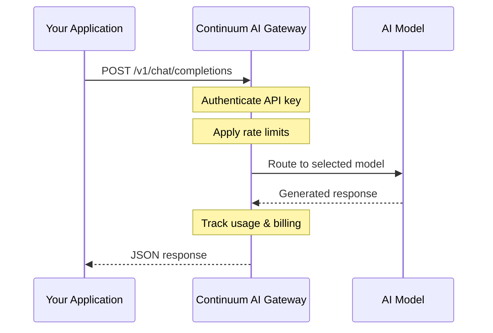
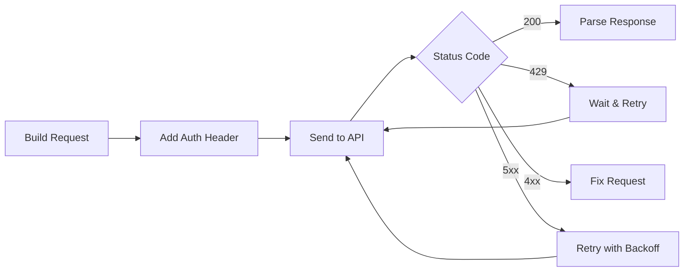

Build intelligent applications by integrating the Continuum AI API into your development workflow. This guide walks you through setting up your environment, making your first API call, and understanding the request lifecycle.

## How it works



## Set up your environment

<Steps>
  <Step title="Get your API key">
    Sign in to the [Continuum AI dashboard](https://yourai.continuumai.app/) and create a new API key from your project settings. Store it securely as an environment variable.

    ```bash
    export CONTINUUM_API_KEY="sk-proj-your-api-key"
    ```
  </Step>

  <Step title="Make your first request">
    Test your setup with a simple curl request:

    ```bash
    curl -X POST https://api.continuumai.technology/v1/chat/completions \
      -H "Authorization: Bearer $CONTINUUM_API_KEY" \
      -H "Content-Type: application/json" \
      -d '{
        "model": "continuum-ultra",
        "messages": [
          {"role": "user", "content": "Hello, Continuum!"}
        ]
      }'
    ```

    You should receive a JSON response with the model's completion.
  </Step>

  <Step title="Integrate into your app">
    Use any HTTP client in your language of choice. All requests go directly to the REST API.

    <CodeGroup>

    ```python Python
    import os
    import requests

    response = requests.post(
        "https://api.continuumai.technology/v1/chat/completions",
        headers={
            "Authorization": f"Bearer {os.environ['CONTINUUM_API_KEY']}",
            "Content-Type": "application/json",
        },
        json={
            "model": "continuum-ultra",
            "messages": [{"role": "user", "content": "Hello!"}],
        },
    )

    print(response.json()["choices"][0]["message"]["content"])
    ```

    ```javascript Node.js
    const response = await fetch("https://api.continuumai.technology/v1/chat/completions", {
      method: "POST",
      headers: {
        "Authorization": `Bearer ${process.env.CONTINUUM_API_KEY}`,
        "Content-Type": "application/json",
      },
      body: JSON.stringify({
        model: "continuum-ultra",
        messages: [{ role: "user", content: "Hello!" }],
      }),
    });

    const data = await response.json();
    console.log(data.choices[0].message.content);
    ```

    </CodeGroup>
  </Step>
</Steps>

## API request lifecycle



Every request to Continuum AI follows this pattern:

1. **Build the request** -- construct the JSON body with your model, messages, and parameters
2. **Authenticate** -- include your API key in the `Authorization: Bearer` header
3. **Send** -- POST to the appropriate endpoint at `https://api.continuumai.technology/v1/`
4. **Handle the response** -- parse the JSON response or handle errors with retry logic

## Available endpoints

```mermaid
graph TD
    A[api.continuumai.technology/v1] --> B[/chat/completions]
    A --> C[/responses]
    A --> D[/embeddings]
    A --> E[/images/generations]
    A --> F[/audio/speech]
    A --> G[/audio/transcriptions]
    A --> H[/moderations]
    A --> I[/files]
    A --> J[/fine_tuning/jobs]
    A --> K[/threads]
    A --> L[/vector_stores]
    A --> M[/batches]
    style A fill:#FF5A1F,color:#fff
```

<CardGroup cols={2}>
  <Card title="API reference" icon="code" href="/api-reference/introduction">
    Full documentation for every endpoint, parameter, and response format.
  </Card>
  <Card title="Error handling" icon="triangle-exclamation" href="/api-reference/errors">
    Retry strategies and error code reference.
  </Card>
  <Card title="Models" icon="robot" href="/api-reference/models">
    Browse available models and their capabilities.
  </Card>
  <Card title="Authentication" icon="shield-halved" href="/api-reference/authentication">
    API key management and security best practices.
  </Card>
</CardGroup>

## Best practices

<AccordionGroup>
  <Accordion title="Store API keys in environment variables" icon="lock">
    Never hardcode API keys in your source code. Use environment variables or a secrets manager.

    ```bash
    # .env (add to .gitignore)
    CONTINUUM_API_KEY=sk-proj-your-api-key
    ```
  </Accordion>

  <Accordion title="Implement retry logic" icon="rotate">
    Always implement exponential backoff for `429` and `5xx` errors. Check the `Retry-After` header for rate limit responses.
  </Accordion>

  <Accordion title="Use streaming for real-time responses" icon="bolt">
    For chat applications, set `"stream": true` to receive tokens as they are generated. This reduces perceived latency for end users.
  </Accordion>

  <Accordion title="Monitor your usage" icon="chart-bar">
    Use the [Usage & Billing](/api-reference/usage-billing) endpoint to track token consumption and costs programmatically.
  </Accordion>
</AccordionGroup>
